# FASE 4: SISTEMAS DE GESTION EMPRESARIAL

## NOMBRE DEL MODULO

>*Contrato de alquiler de vehículos.*

## DESCRIPCION CORTA
>*Este módulo permite gestionar la creación, firma y control de contratos de alquiler de vehículos de manera automatizada. Facilita la asignación de vehículos, la firma digital, la facturación y el seguimiento de pagos, optimizando la experiencia del cliente y la administración de la flota.*
>>>
## DESCRIPCION DETALLADA DE TODAS LAS FUNCIONALIDADES A CUBRIR
*Gestión de Empleados* 
---
* Registrar y gestionar los clientes con datos personales (DNI, nombre, dirección, teléfono, email).
* Crear contratos de alquiler con clientes.
* Confirmar fechas y horas de cada contrato de alquiler, inicio y fin.
* Comprobar el estado de los vehículos que hay en la base disponibles.
* Registrar vehículo en el contrato con la matrícula, modelo, estado y precio por día.
* Cambiar estado del vehículo a “Alquilado”.
* Añadir observaciones particulares del contrato como explicaciones y situaciones concretas como accidentes, daños no registrados,etc.
* Asociación de equipamientos y seguros a contratos y vehículos específicos.

*Gestión de Flota* 
---
* Controlar estado del vehículo (Disponible, En mantenimiento, Reservado, Alquilado). Visualización en tiempo real de la disponibilidad de cada vehículo.

*Gestión de Contratos de Alquiler*
---
* Generación automática de contratos de alquiler con datos de cliente, vehículo y duración.
* Asociación de precios diarios y costos adicionales en el contrato.
* Integración con una pasarela de pagos para pagos digitales.
* Firma electrónica del contrato y envío automático al correo del cliente.
* Control del estado del contrato (Activo, Finalizado, Cancelado).

*Gestión de Facturación*
---
* Registrar pagos con información de fecha, precio y estado (Pagado, Pendiente, Cancelado).
* Generar de facturas electrónicas.
* Integrar método de pago: tarjeta de crédito/débito.

*Gestión de clientes*
---
* Obtener facturas.
* Modificar sus datos personales.
* Realizar encuesta recibida por correo electrónico.

## MAPA DEL MODULO

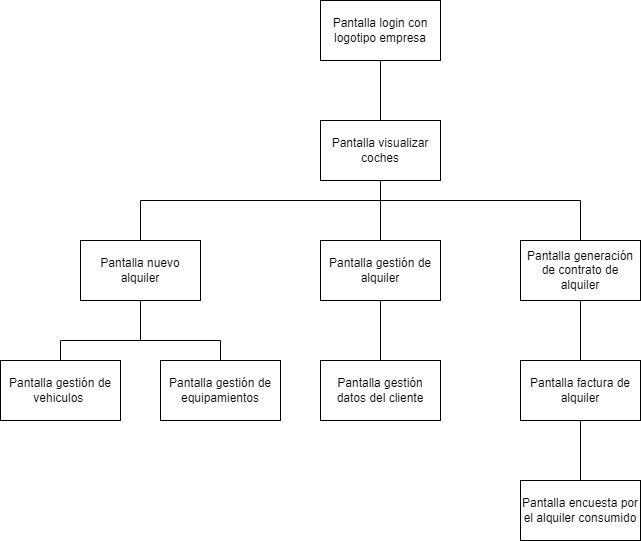

## DEPENDENCIAS DE OTROS MODULOS
*Flota*
---
* Sincronización con el módulo de flotas para gestionar el estado, mantenimiento y disponibilidad de los vehículos.
* Asociación de los vehículos con los contratos de alquiler.
* Registro automático de kilometraje y estado del vehículo tras cada alquiler.

*CRM*
--- 
* Seguimiento de clientes frecuentes y sus preferencias.

*Ventas*
--- 
* Conversión de contratos de alquiler en órdenes de venta para facilitar la facturación.
* Gestión de productos adicionales como seguros y accesorios dentro del flujo de ventas.

*Facturación*
--- 
* Registro automático de pagos y facturas de alquiler.

*Pagos*
---
* Integración con pasarelas de pago para cobros electrónicos.

*Survey*
---  
* Automatización del envío de encuestas post-alquiler y registro.

## WIREFRAMES.
*Pantalla login*
---
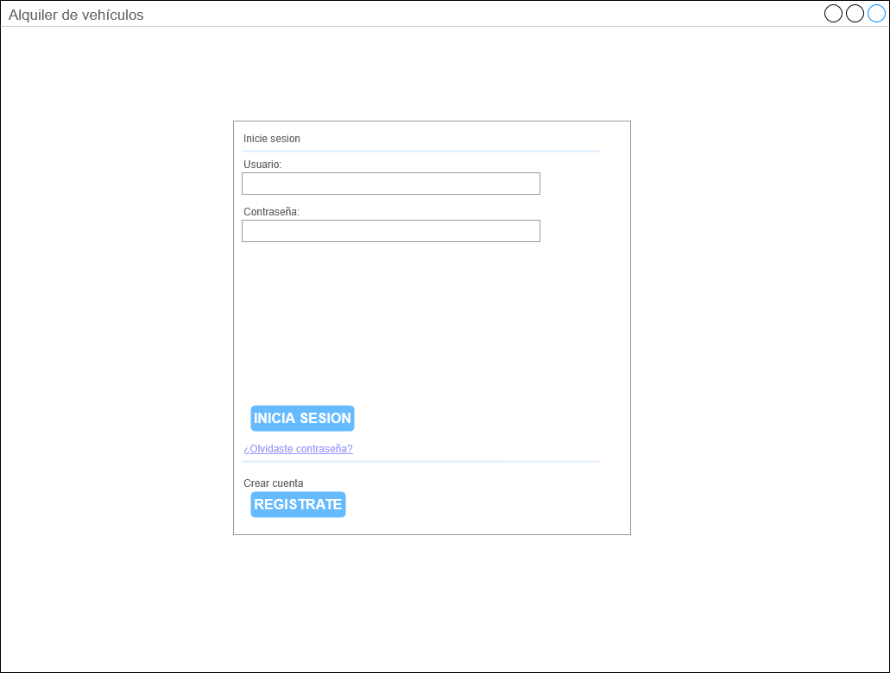

*Pantalla Visualizar Coches*
---
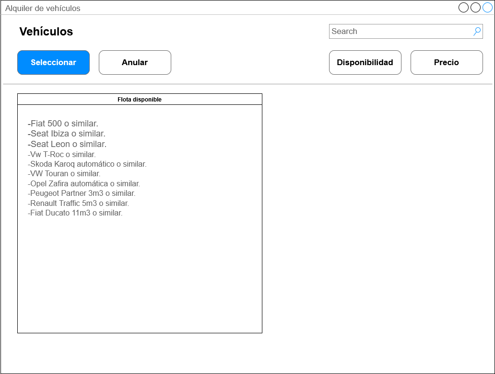

*Pantalla Creación Nuevo Alquiler*
---
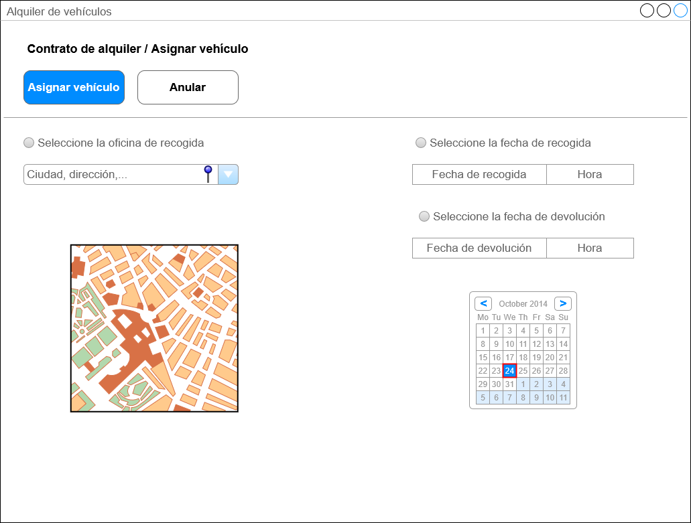

*Pantalla Selección Equipamientos Adicionales*
---
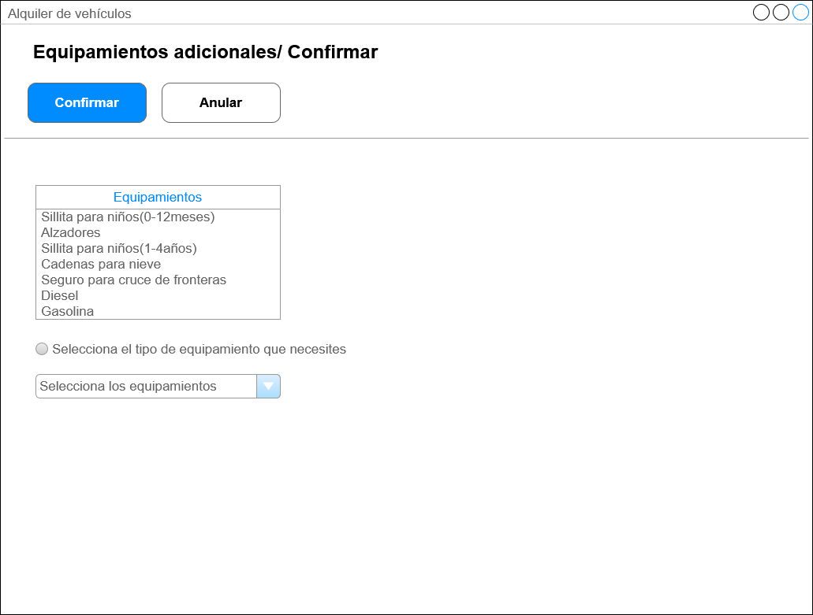

*Pantalla Gestión Datos Cliente*
---
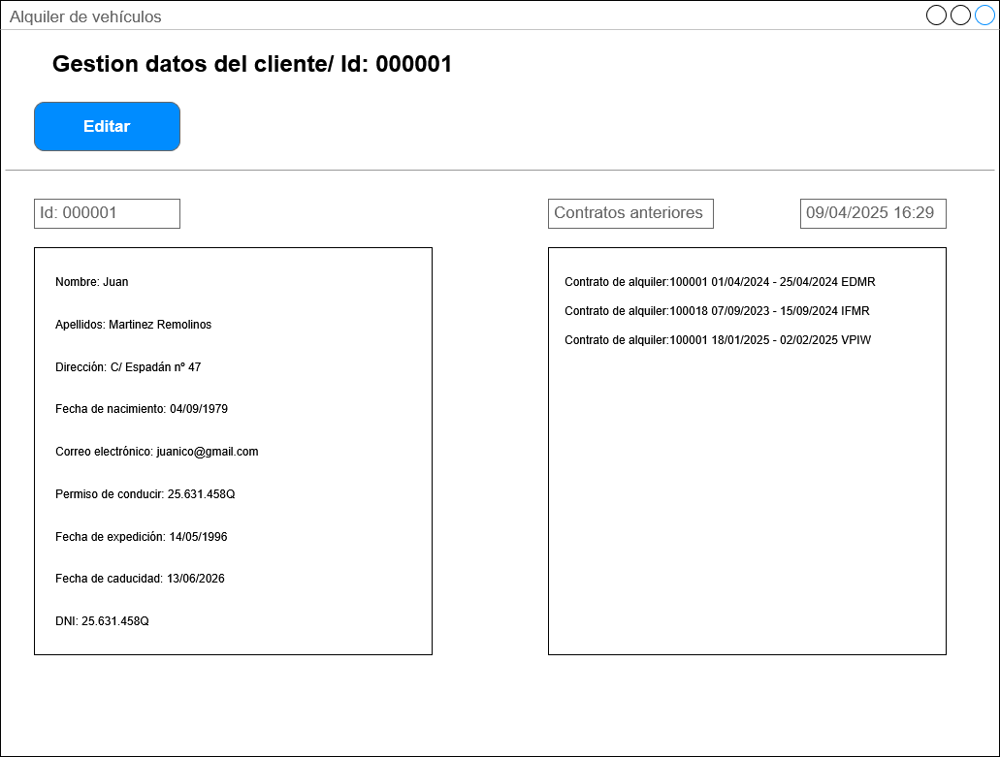

*Pantalla Asignación del vehiculo al contrato*
---
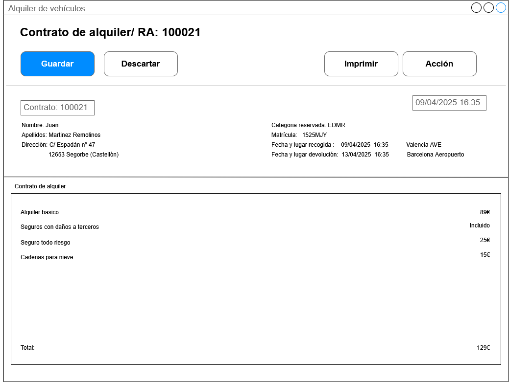

*Pantalla Factura Alquiler*
---
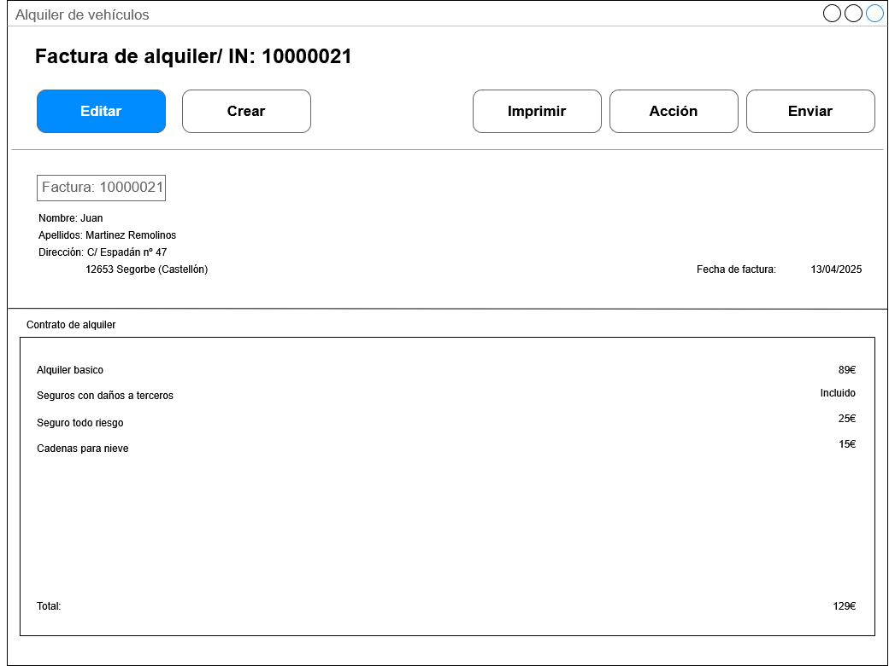

*Pantalla Envío Encuesta*
---
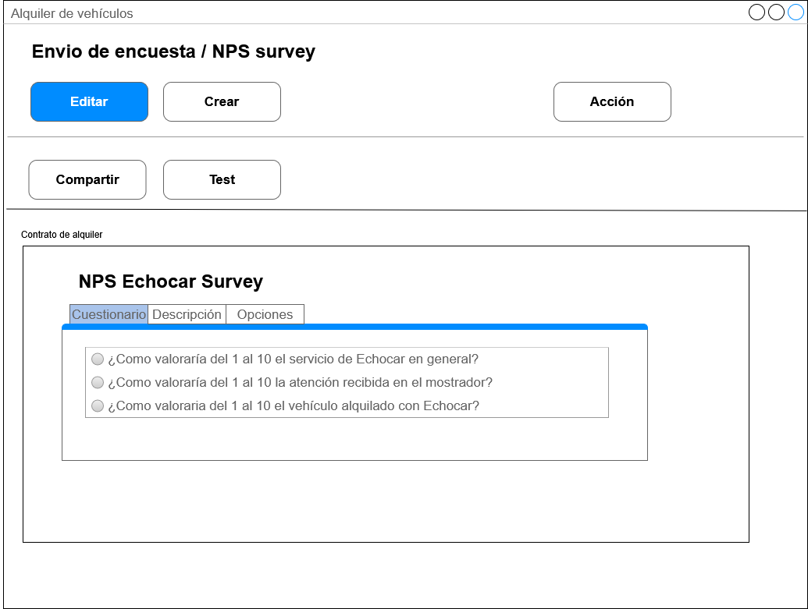

## CONTROL DE ACCESOS. ¿Qué grupos existen?¿Quién puede acceder o no al módulo?¿ A qué modelos? ¿a qué registros? ¿Con qué permisos?
*Inicio de sesión y autenticación*
---
Todos los usuarios acceden al sistema mediante credenciales según su perfil.

*Visualización de vehículos*
---
Implicados: Cliente, Atención al cliente, Gestor de Oficina y Gestor de Flota

Los clientes pueden ver los tipos de vehículos disponibles. Internamente, se consulta la disponibilidad para reservas o gestión de flota.

*Creación de nuevo alquiler*
---
Implicados: Atención al cliente y gestor de Oficina

Atención al cliente puede iniciar la reserva y recopilar datos. El gestor de Oficina formaliza el alquiler.

*Selección de equipamientos adicionales*
---
Implicado: Gestor de Oficina

Con la elección del cliente en función de sus necesidades

*Gestión de datos del cliente*
---
Implicados: Cliente, atención al cliente y gestor de Oficina

El cliente puede editar sus propios datos. El gestor los registra o valida durante el proceso. Atención al cliente puede consultar contratos historiales y ver datos del cliente.

*Asignación y control de vehículos*
---
Implicado: Gestor de Oficina.

El Gestor de Oficina asigna el vehículo al contrato y genera un contrato de alquiler con precios desglosados y total.

*Facturación y pagos*
---
Implicados: Cliente, Atención al cliente y gestor de Oficina

El cliente realiza el pago. Atención al cliente verifica y el gestor supervisa el proceso y confirma la factura.

*Envío y respuesta de encuesta*
---
Implicados: Cliente y responsables

Tras finalizar el alquiler el cliente recibe una encuesta. Los responsables analizan los resultados.

## DIAGRAMAS DE FLUJOS FUNCIONALES
*Inicio de sesión y autenticación*
---

---
*Visualización de vehículos*
---
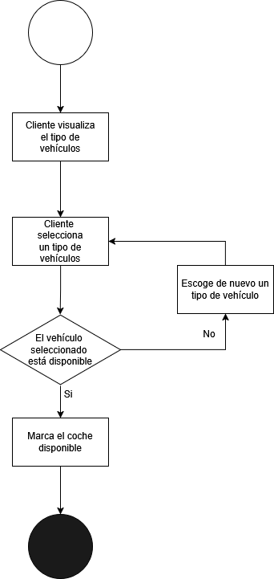
---
*Creación de nuevo alquiler*
---

---
*Selección de equipamientos adicionales*
---
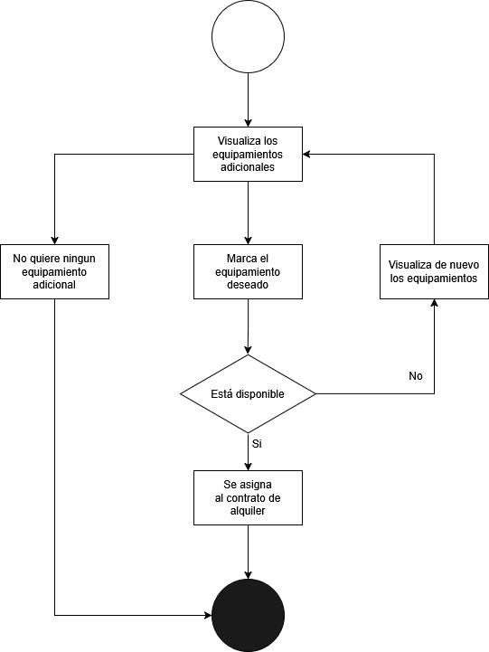
---
*Gestión de datos del cliente*
---
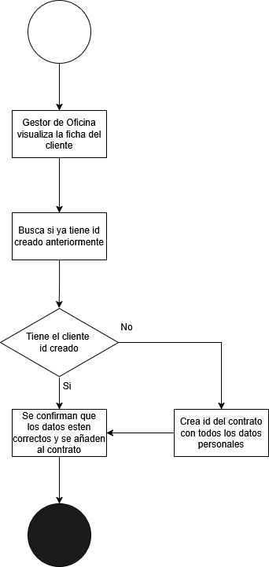
---
*Asignación y control de vehículos*
---
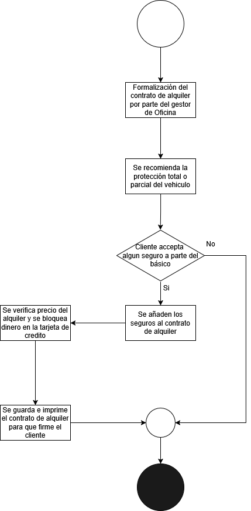
---
*Facturación y pagos*
---
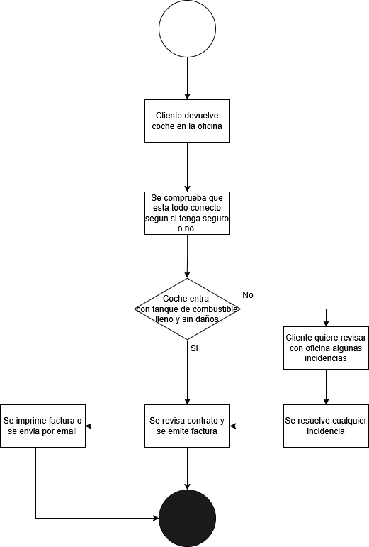
---
*Envío y respuesta de encuesta*
---
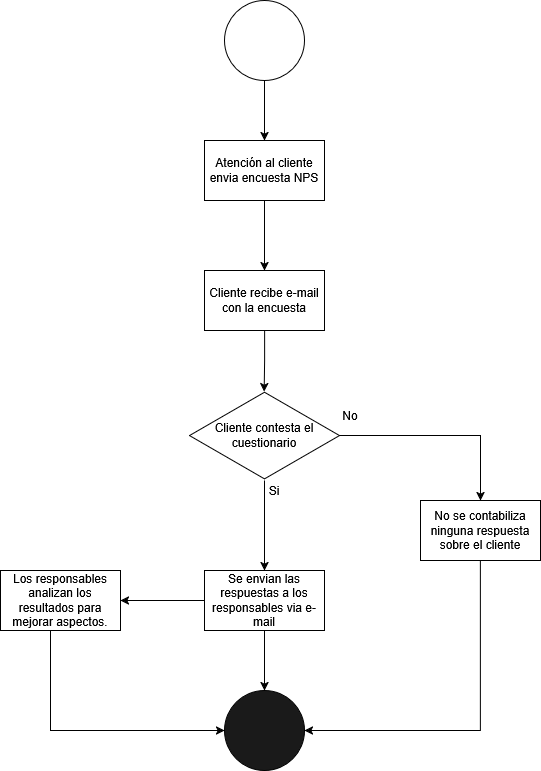
---

## ESQUEMA RELACIONAL DE LAS NUEVAS TABLAS EN LA BASE DE DATOS Y RELACION CON OTRAS EXISTENTES
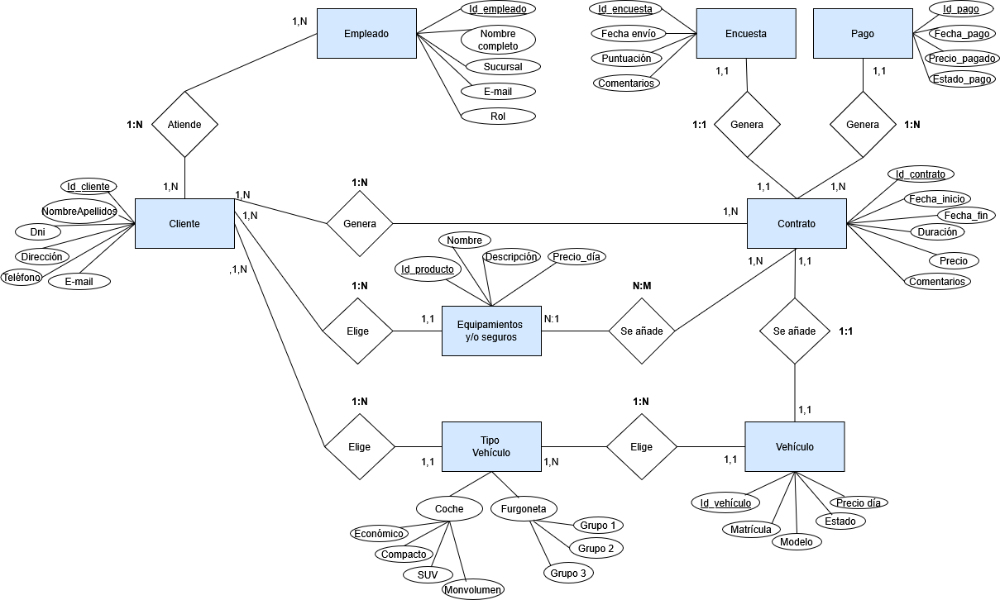

